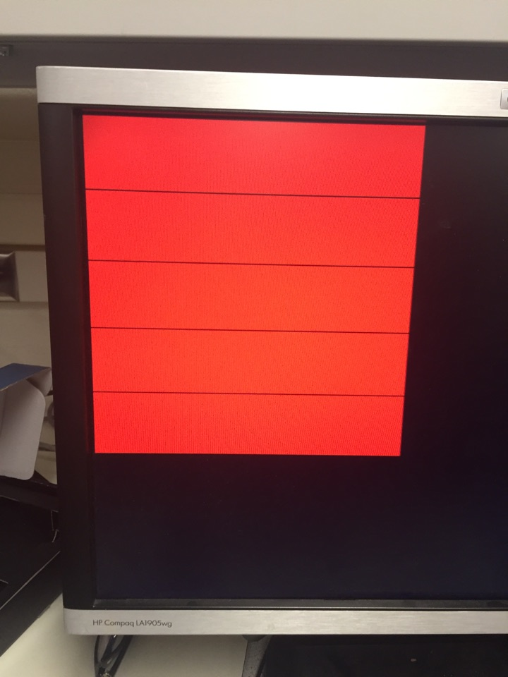

## Lab 4

### Objectives

### Radio Team

### FPGA Team
* Arduino Board
* DE0-NANO Board 
* VGA Cable
* VGA Switch
* Various resistors

For this lab, we first had to scale up the grid from a 2x2 to a 4x5, which was fairly straightforward to implement. A photo of it is below:

We next had to implement some communication system between the Arduino and the FPGA board -- we initially planned to use the SPI method, but abandoned it after we ran into problems debugging it. Instead, we implemented parallel communication between the Arduino and the FPGA board. We coded the Arduino to send 5-bit dummy robot coordinates via digital pins (2 bits/pins for the x coordinate, 3 bits/pins for the y coordinate), and tested its functionality with the oscilloscope. In the diagram below, we sent out coordinates (1, 1):

After ensuring that the Arduino was outputting correctly, we then build a series of voltage dividers (100 and 50 ohms) to pass the data from the Arduino to the FPGA, due to the voltage mismateches between the two boards, and connected the Arduino outputs to the appropriate GPIO pins. Our setup is shown below:

.

In order to communicate information from the Arduino to the FPGA, we choose to implement a parallel implementation due to its relative simplicity compared to the SPI protocol.  We converted the x and y values on the receiving RF Arduino into bit values. The x values had two bits associated with them (the robot can only be at x coordinates from 0 to 3, therefore there are 4 possible options - 00, 01, 10, 11). The  y values had three bits associated with them (the robot can only be at y coordinates from 0 to 4, therefore there are 5 possible options - 00, 01, 10, 11, 100). Combined, they would represent the 20 grid coordinates of the maze. 

For the final step, we had to code the color for the states the simulated robot passed through. The default state for every coordinate was "untraversed", meaning it was colored red on the grid. As the robot received new coordinates from the Arduino, it would move to the directed square and color it blue, indicating it as the square it was currently on; as the robot moved onto a new square, the FPGA would color the last coordinate of the robot green, indicating that the robot had visited the square already. If the robot revisited a square, it would turn blue again, just to indicate the robot's position, before turning back to green once the robot left the square. 

Debugging the code
