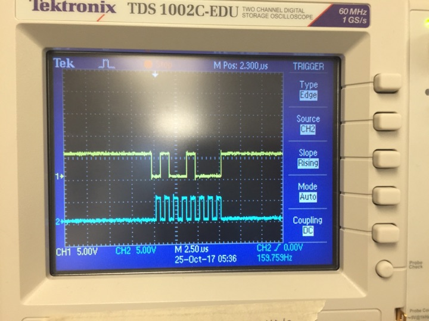
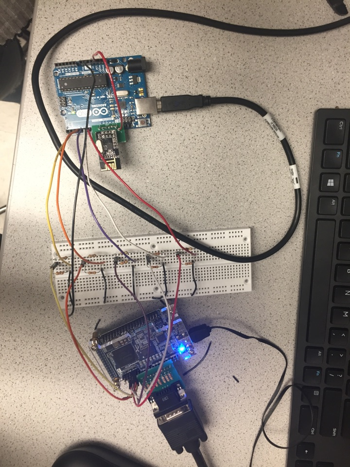

## Lab 4

### Objectives

For this lab, we had to implement radio communication between the Arduino and FPGA. 
### Radio Team
Russell, Giacomo

#### Materials
* 2 Nordic nRF24L01+ transceivers
* 2 Arduino Unos (one must be shared with the other sub-team)
* 2 USB A/B cables
* 2 radio breakout boards with headers


The example code provided an implementation of RF that would transmit the current time using the millis() function. The time value was sent on the transmitting end through the use of the radio.write() function. This value was received on the other Arduino through the use of the radio.read() function. 

We replaced the “got_time” variable that represented the time value in the example code with another unsigned long variable. This unsigned long variable would be used to send over coordinates in the later parts of this lab.

Instead of sending the entire maze wirelessly for each iteration at the end of the Arduino’s loop delay, we decided to only send the current coordinates’ x and y values. We represented the coordinate as a two digit number with the y value first and the x value second in the transmitting Arduino. For example, if we were to transmit the current coordinate (2,3), we would transmit 32. We thought that sending individual tile data would be better than sending the whole maze array as it reduces the number of packets between the transmitting and receiving arduinos for every “move” that our robot makes. 

On the receiving end, this two digit number would be converted back to an individual x and value through the use of the following lines:
   ```
   int x = recieved_x_variable % 10      //The remainder is the least significant digit 
   int y = recieved_y_variable / 10        //The divisor is the most significant digit
   ```
   
Once individual x and y values were extracted, we converted them into bit values which explained the in the maze communication section. The bit values would determine the digital outputs that would send the information parallely to the FPGA. For example, if x = 2 and y = 3, x would be set to 2’b10 and y would be set to 3’b011. Next, the digital pins corresponding to the most significant bit in the x value and 2 least significant bits in the y values would be set to HIGH, and the rest of the digital pins would be set to LOW.


### FPGA Team
Michelle, Kristina, Jo

#### Materials
* Arduino Board
* DE0-NANO Board 
* VGA Cable
* VGA Switch
* Various resistors

We updated our Verilog code from Lab 3 to display a 4 by 5 grid array instead of a 2 by 2 grid array. This was done by expanding upon the memory locations so that all of the grid’s 20 squares can be accounted for with their respective colors.

The code displayed below shows how we assigned pixel colors to all of gridscreen’s square areas.
 ```
    if (rdy == 0) begin
        gridscreen[0][0] = 8'b111_000_00;
        gridscreen[0][1] = 8'b111_000_00;
        gridscreen[0][2] = 8'b111_000_00;
        gridscreen[0][3] = 8'b111_000_00;
        gridscreen[0][4] = 8'b111_000_00;
     
        gridscreen[1][0] = 8'b111_000_00;
        gridscreen[1][1] = 8'b111_000_00;
        gridscreen[1][2] = 8'b111_000_00;
        gridscreen[1][3] = 8'b111_000_00;
        gridscreen[1][4] = 8'b111_000_00;
     
        gridscreen[2][0] = 8'b111_000_00;
        gridscreen[2][1] = 8'b111_000_00;
        gridscreen[2][2] = 8'b111_000_00;
        gridscreen[2][3] = 8'b111_000_00;
        gridscreen[2][4] = 8'b111_000_00; 
     
        gridscreen[3][0] = 8'b111_000_00;
        gridscreen[3][1] = 8'b111_000_00;
        gridscreen[3][2] = 8'b111_000_00;
        gridscreen[3][3] = 8'b111_000_00;
        gridscreen[3][4] = 8'b111_000_00;
        rdy = 1;
    end
```

The “rdy” bit was used to initialize the grid array. By initializing the grid array, we could avoid flickering blocks on the screen which signified that the Verilog Code was setting two colors at once on one grid square area. The rdy bit was initialized to 0 towards the top of our code so that the if statement would evaluate to true the first time. Once all the grid squares were set in “gridscreen” the rdy bit was set to 1 so that the grid array wouldn’t be initialized again.

We iterated through this memory area with double for loop taken from Lab 3’s implementation. Only the maximum values for variable “i” and “j” were changed in the double for loop as well as the “PIXEL_WIDTH” and “PIXEL_HEIGHT” for larger squares. This part of the implementation was scarcely changed because the iteration can set the square colors in a grid array of any arbitrary size.
The code for this iteration is shown below:
```
    PIXEL_WIDTH = 10'd64;
    PIXEL_HEIGHT = 10'd64;
      if ((PIXEL_COORD_X < 4 * PIXEL_WIDTH) && (PIXEL_COORD_Y < 5 * PIXEL_HEIGHT)) begin
   	    for (i = 10'd0; i <= 10'd4; i = i + 10'd1) begin
   		    for (j = 10'd0; j <= 10'd3; j = j + 10'd1) begin
   			    if(((j * PIXEL_WIDTH < PIXEL_COORD_X) && (PIXEL_COORD_X < (j + 10'd1) * PIXEL_WIDTH)) && ((i * PIXEL_HEIGHT < PIXEL_COORD_Y) && (PIXEL_COORD_Y < (i + 10'd1) * PIXEL_HEIGHT))) begin
   				    PIXEL_COLOR = gridscreen[j][i];
   			    end		 
   		    end	 
   	    end
      end
   	 
      else begin
   	    PIXEL_COLOR = 8'b000_000_00;
      end	
```


We next had to implement some communication system between the Arduino and the FPGA board. Our first attempt was for an SPI system: we coded the Arduino to send 5-bit dummy robot coordinates via digital pins (2 bits for the x coordinates, 3 bits for the y coordinate), and tested its functionality with the oscilloscope. A picture of its output is shown below for output (1, 1):



Our code for the FPGA is shown below: 
```
    always @ (posedge SPI_CLK) begin
    	    if(CS == 0 && rf == 0) begin
   	 
    	    for (i = 8'd0; i <= 8'd4; i = i + 8'd1) begin
        	    datain[i] = MOSI;
        	    rf = 1'b1;
    	    end
   	 
    	    //parsing
    	    //grid_coord_x = datain[4:3];
    	    //grid_coord_y = datain[2:0];
   	      //grid_coord_x = 4'd2;
   	      // grid_coord_y = 5'd3;
   	      rf = 1'b0;
 	        end
      end
```      
We abandoned our attempt at SPI after we ran into problems debugging. Instead, we implemented parallel communication between the Arduino and the FPGA board due to time constraints and our unfamiliarity with SPI protocol. Additionally, the Arduino pins required for the RF module utilized the same pins as that of the SPI, so instead of using a multiplexer or some other form of hardware solution for this, we decided to implement the parallel communication. 

```insert parallel code here ```

After ensuring that the Arduino was outputting correctly, we then built a series of voltage dividers (100 and 50 ohms) to pass the data from the Arduino to the FPGA, due to the voltage mismatches between the two boards, and connected the Arduino outputs to the appropriate GPIO pins. Our setup is shown below:

.

In order to communicate information from the Arduino to the FPGA, we choose to implement a parallel implementation due to its relative simplicity compared to the SPI protocol.  We converted the x and y values on the receiving RF Arduino into bit values. The x values had two bits associated with them (the robot can only be at x coordinates from 0 to 3, therefore there are 4 possible options - 00, 01, 10, 11). The  y values had three bits associated with them (the robot can only be at y coordinates from 0 to 4, therefore there are 5 possible options - 00, 01, 10, 11, 100). Combined, they would represent the 20 grid coordinates of the maze. 

For the final step, we had to code the color for the states the simulated robot passed through. The default state for every coordinate was "untraversed", meaning it was colored red on the grid. As the robot received new coordinates from the Arduino, it would move to the directed square and color it blue, indicating it as the square it was currently on; as the robot moved onto a new square, the FPGA would color the last coordinate of the robot green, indicating that the robot had visited the square already. If the robot revisited a square, it would turn blue again, just to indicate the robot's position, before turning back to green once the robot left the square. 

That scenario is unfortunately theoretical. The  actual grid is not updating correctly. The radio is set up to snake through the grid: it would start at (0,0), move right 3 coordinates, move down 1 coordinate, move left 3 coordinates, etc, of which the grid is not updating correctly. A video of our current result is shown below; we have not yet finished debugging the code:

Insert video here.

We ran into many bugs when attempting to implement the grid, the first of which were floating variables: since we did not assign initial variables for some of the values in either the Arduino code or the FPGA (or assign a common ground between the two boards), we had grid initializations with random green squares in the supposedly default red. A second problem that emerged was that the 3rd bit of y coordinate was never transmitting correctly: the 0, 2, and 4th rows of the grid were turning green at the correct times, while the 1st and 3rd rows remained red. When debugging, 
