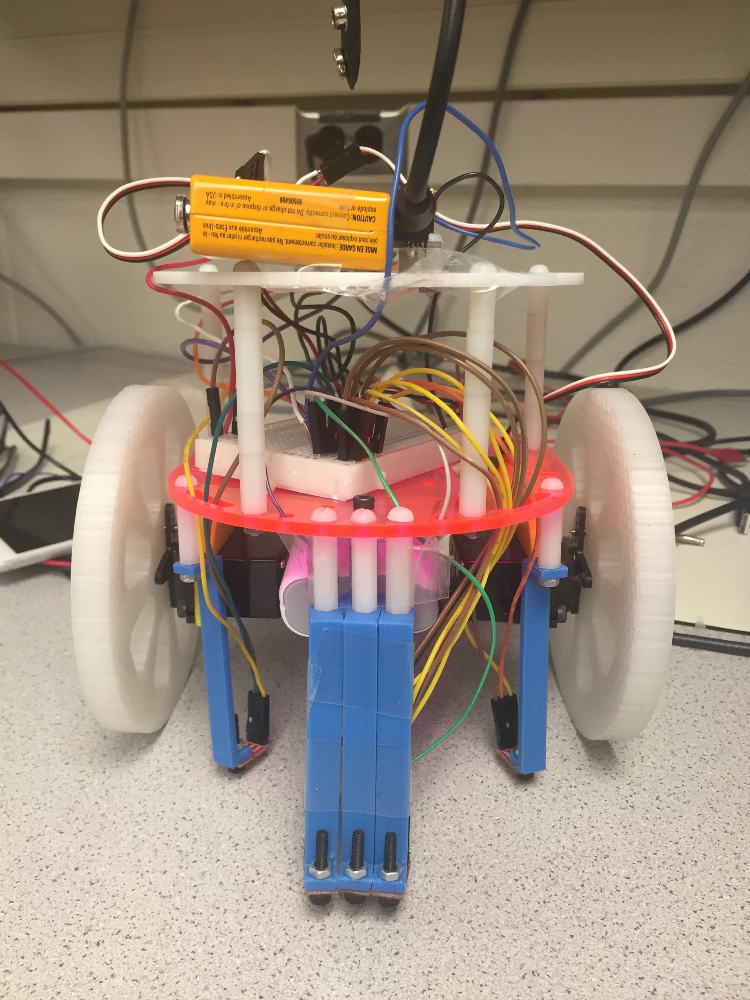

## Milestone 1

### Objective

The objective of the milestone was to have the robot follow a line of black tape and traverse a grid in the shape of a figure 8.

#### Materials
- 5 QRE-1113 sensors
- 2 Servos 
- A lot of jumper wires

#### Line Following

We connected 5 sensors to the robot: 3 in the front, 2 in the back. We tested each of them to determine a threshold value of 840, for which they would detect white or black. Detecting "white" meant that the analogRead values of the sensors would never exceed 840; detecting "black" meant that the sensors would always read above 840.

The three front sensors were meant to detect whether the robot was on a line. In our code, when the front middle sensor and one of the front side sensors is sensing the black line, the robot is considered on the line. When one of the side sensors and the front middle sensor are off the line, the robot is considered off the line and the robot will readjust accordingly. The two back side sensors are used to detect cross sections. When the front sensors are on a black line and the back side sensors both detect a black line, the robot is considered on a cross section. Our code is shown below:
  
    void move(){
  
      if (analogRead(M) >= threshold ){
        leftservo.write(103);     
        rightservo.write(85); 
    } 
       //if leftfront and middle sensor is white and rightfront is black, move right, left wheel faster
      else if((analogRead(LF)<=threshold)){
        leftservo.write(98);     
        rightservo.write(94);
      }

       //if rightfront and middle sensor is white and leftfront is black, move left, right wheel faster
      else if(analogRead(RF)<=threshold){
        leftservo.write(94);     
        rightservo.write(89);
      }
    }
  
Our first (presentable) test run worked like [this.](https://youtu.be/_Q0ooO84H1s)
We later decided to slow down the servos so that our robot could line follow more smoothly. [Here](https://youtu.be/zvR32bmpkww) it is.

#### Figure Eight

We included our line-following code with the figure 8 code to make things easier, and as a result, our figure eight implementation is relatively straight forward: if the back two sensors detected a line, then it meant that the robot was at a cross section, and would subsequently turn right and follow the line (4 times) before turning left and following the line (also 4 times). When turning, we commanded one wheel to stop while allowing the other wheel to keep moving, allowing the robot to turn in the direction of the wheel that had stopped. Below is our code for detecting cross sections:

    void move_one(){ //move forward until it's at a cross section
      while((analogRead(LB) >= threshold_l &&analogRead(RB) >=threshold_r)!=true){
        move();}
      leftservo.write(94);     
      rightservo.write(94);   
      }

  
For the turning functionality, we created helper functions _turn_left_ and _turn_right_. An example is below: 

    void turn_right(){
      leftservo.write(98);      
      rightservo.write(98);
      delay(500);
      while(analogRead(M)<=threshold){
        leftservo.write(98);     
        rightservo.write(98);
      }
    }
    
And as mentioned previously, our _figure_eight_ function was simply having the robot turn right and keep moving until a cross section before turning right again, and turning left after 4 right turns and repeating the same thing.

    void figure_eight(){ 
      move_one();
      turn_right();
      move_one();
      turn_right();
      move_one();
      turn_right();
      move_one();
      turn_right();
      move_one();
      turn_left();
      move_one();
      turn_left();
      move_one();
      turn_left();
      move_one();
      turn_left();
      move_one();
    }

 
[Here](https://youtu.be/_kyliNbJiFA) is a video of the robot following a figure eight. We later adjusted the back sensor positions and increased the turning speed. [Here](https://youtu.be/0ZVRnUeEuHg) is our slightly speedier robot. 

