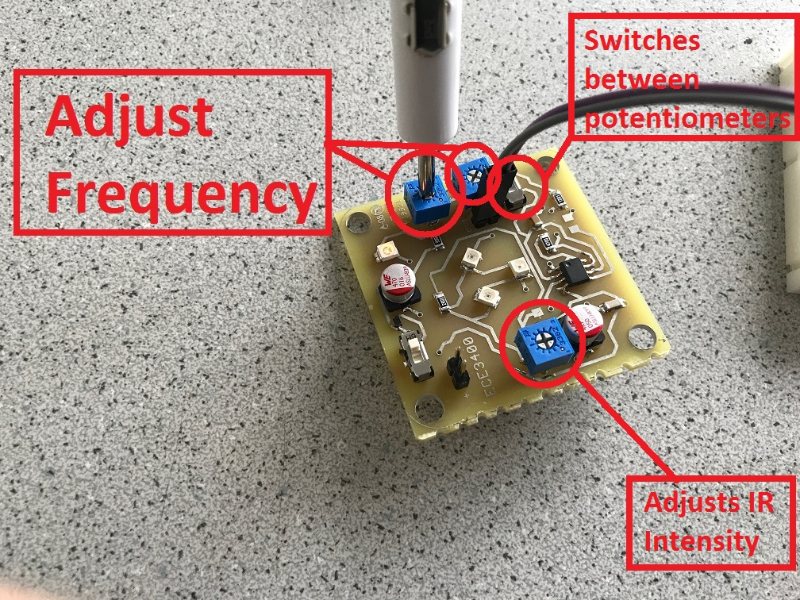

## Milestone 2

### Objective

One of the objectives of the milestone was to be able to detect and classify between different treasures (frequencies will be 7kHz, 12kHz, and 17kHz). In addition we had to implement wall detection to the robot.

#### Materials
- [Infrared Proximity Sensor Short Range - Sharp GP2Y0A41SK0F](http://www.sharp-world.com/products/device/lineup/data/pdf/datasheet/gp2y0a41sk_e.pdf)
- IR treasure
- Oscilliscope
- A line-following robot
- Some wires

#### Treasure Detection
We used the oscilliscope connected to the outputs of the treasure (which is shown in the image below) in order to set the frequency at 7kHz, 12kHz, and 17kHz. We do this to ensure that the values measured by the phototransistor circuit will be as accurate as possible. 

 

This video (as shown in Lab 2) reiterates our IR system’s ability to detect and distinguish tones of 7 kHz, 12 kHz, and 17 kHz: [here](https://www.youtube.com/watch?v=DN9lzJqB21Q)

In this demonstartion, we show our detection for each frequency with a 3 LED setup. The program on the arduino detects the bins that contain the peak of the FFT. Then we output to a certain pin to light the correct LED. We also have an inverting Op-Amp inorder to get a more accurate bin read on the FFT.

Red LED = 7kHz

Blue LED = 12 kHz

Green LED = 17kHz

