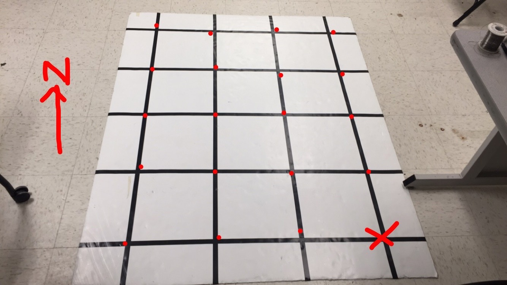

## Milestone 3

### Objectives

The goal of this milestone is to implement algorithm to facilitate maze exploration on a 5x4 grid of this layout: 


Figure 1. Maze grid. Each intersection represents a grid location. "x" is where the robot starts and north is the top of the grid. 

Ultimately, we want working algorithm that facilitates maze exploration and indication that all that can be explored has been explored- in simulation and in real life. 


### Storing the Maze

Our first step was to decide on how to “translate” a maze into code. We followed the advice of [team alpha] (https://cei-lab.github.io/ECE3400-2017-teamAlpha/milestone3.html) and chose to save information about the maze in two 5x4 matrices. One 5x4 matrix contains data on whether or not each location on the maze has or has not been explored (1 being unexplored and 0 being explored). Each index of the matrix corresponds to the respective coordinate on the real maze grid. The other matrix contains information about the walls in the maze. Each corresponding index of the matrix contains a decimal number (0 to 15). Each decimal number can be converted to a 4-bit binary number, where each bit will represent the presence (or absence) of a wall. A 1 indicates the absence of a wall and a 0 represents the presence of a wall. Please see Figure I for how we specified directions (“north,” “south” etc.) The bits are organized as follows:
                                              West East South North
           Ex. 0011 would mean there is a wall to the west and east of the robot. 

### Simulation

Our group chose to implement the simulation in Java. However, we did not know about the simulation code provided to us until we had already implemented depth first search (DFS). Therefore, our algorithm is not compatible with the graphical representation provided to us. However, we are still able to show that our algorithm works!  

A. Proof our algorithm works

Here is a video of our code running:

Here is what our code printed out:
```
x location:3
y location:4
...
x location:2
y location:4
...
x location:1
y location:4
...
x location:0
y location:4
...
x location:0
y location:3
...
x location:0
y location:2
...
x location:0
y location:1
...
x location:0
y location:0
...
x location:1
y location:0
...
x location:2
y location:0
...
x location:3
y location:0
...
x location:3
y location:1
...
x location:3
y location:2
...
x location:3
y location:3
...
x location:1
y location:1
...
x location:1
y location:3
...
x location:2
y location:3
...
x location:3
y location:4
...
all searched[[I@7f31245a, [I@6d6f6e28, [I@135fbaa4, [I@45ee12a7, [I@330bedb4, [I@2503dbd3, [I@4b67cf4d, [I@7ea987ac, [I@12a3a380, [I@29453f44, [I@5cad8086, [I@6e0be858, [I@61bbe9ba, [I@610455d6, [I@511d50c0, [I@60e53b93, [I@5e2de80c]
```
Here is the maze we used (both in matrix form and in real life): 
{ { 9, 1, 3, 5 },                    
 { 8, 6, 13, 12}, 
{ 12, 11, 6, 12 }, 
{ 8, 3, 7, 14 }, 
{ 10, 3, 3, 7 } };


This is how the maze would be set up in real life. Picture is taken from video provided by Team Alpha. 
As you can see, the locations our algorithm outputs match the grids the robot traverses in Team Alpha’s . 

B. How we implemented our algorithm (see MapNav.java and Arduino.java) 

We chose to create a Arduino object which contains the current location of our robot ( the x and y coordinates) and the direction our robot is facing.  The appropriate functions ( ie. setters and getters) were implemented. We are assuming that our robot starts at the right-bottom grid. See Figure 1.  The grid corresponds to the index [4][3] on our matrix.  It should be noted that we refer to the “x-coordinate” as the column index and the “y-coordinate” as the row index. 

We implemented DFS with two linked lists and used our “frontier” list as a stack. The pseudocode is as follows:
```
   LinkedList<Arduino> frontier;            // contains grid location that still need to be searched 
   LinkedList<Arduino nodesSearched;        // contains grid locations that have been searched.
   while  (frontier is not empty){
      //Pop from top of frontier
      if(there is no wall && adjacent grid is not in frontier&&adjacent grid is not in nodesSearched){
      //Append adjacent grid locations to top of frontier
    }
    }
Print out that all possible nodes have been searched
```


