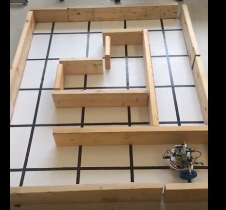
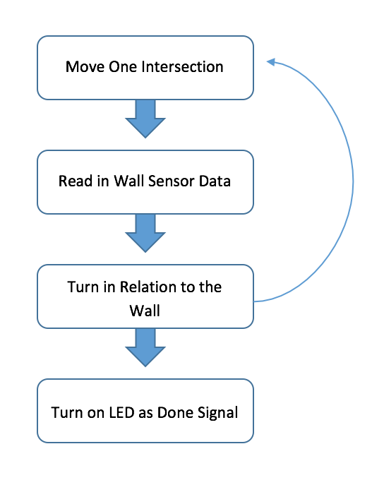

## Milestone 3

### Objectives

The goal of this milestone is to implement algorithm to facilitate maze exploration on a 5x4 grid of this layout: 


Figure 1. Maze grid. Each intersection represents a grid location. "x" is where the robot starts and north is the top of the grid. 

Ultimately, we want working algorithm that facilitates maze exploration and indication that all that can be explored has been explored- in simulation and in real life. 


### Storing the Maze

Our first step was to decide on how to “translate” a maze into code. We followed the advice of [team alpha](https://cei-lab.github.io/ECE3400-2017-teamAlpha/milestone3.html) and chose to save information about the maze in two 5x4 matrices. One 5x4 matrix contains data on whether or not each location on the maze has or has not been explored (1 being unexplored and 0 being explored). Each index of the matrix corresponds to the respective coordinate on the real maze grid. The other matrix contains information about the walls in the maze. Each corresponding index of the matrix contains a decimal number (0 to 15). Each decimal number can be converted to a 4-bit binary number, where each bit will represent the presence (or absence) of a wall. A 1 indicates the absence of a wall and a 0 represents the presence of a wall. Please see Figure I for how we specified directions (“north,” “south” etc.) The bits are organized as follows:
                                              West East South North
           Ex. 0011 would mean there is a wall to the west and east of the robot. 

### Simulation

Our group chose to implement the simulation in Java. However, we did not know about the simulation code provided to us until we had already implemented depth first search (DFS). Therefore, our algorithm is not compatible with the graphical representation provided to us. However, we are still able to show that our algorithm works!  

#### A. Proof our algorithm works

[Here](https://www.youtube.com/watch?v=H1WoLMxlXM0) is a video of our code running. Here is what our code printed out:
```
x location:3
y location:4
...
x location:2
y location:4
...
x location:1
y location:4
...
x location:0
y location:4
...
x location:0
y location:3
...
x location:0
y location:2
...
x location:0
y location:1
...
x location:0
y location:0
...
x location:1
y location:0
...
x location:2
y location:0
...
x location:3
y location:0
...
x location:3
y location:1
...
x location:3
y location:2
...
x location:3
y location:3
...
x location:1
y location:1
...
x location:1
y location:3
...
x location:2
y location:3
...
x location:3
y location:4
...
all searched[[I@7f31245a, [I@6d6f6e28, [I@135fbaa4, [I@45ee12a7, [I@330bedb4, [I@2503dbd3, [I@4b67cf4d, [I@7ea987ac, [I@12a3a380, [I@29453f44, [I@5cad8086, [I@6e0be858, [I@61bbe9ba, [I@610455d6, [I@511d50c0, [I@60e53b93, [I@5e2de80c]
```
Here is the maze we used (both in matrix form and in real life): 
```
{ { 9, 1, 3, 5 },                    
{ 8, 6, 13, 12}, 
{ 12, 11, 6, 12 }, 
{ 8, 3, 7, 14 }, 
{ 10, 3, 3, 7 } };
```


Figure 2. This is how the maze would be set up in real life. Picture is taken from video provided by Team Alpha. 
As you can see, the locations our algorithm outputs match the grids the robot traverses in Team Alpha’s [video](https://www.youtube.com/watch?v=tvfH1x9lJSg). 


#### B. How we implemented our algorithm (see MapNav.java and Arduino.java) 

We chose to create a Arduino object which contains the current location of our robot ( the x and y coordinates) and the direction our robot is facing.  The appropriate functions ( ie. setters and getters) were implemented. We are assuming that our robot starts at the right-bottom grid. See Figure 1.  The grid corresponds to the index [4][3] on our matrix.  It should be noted that we refer to the “x-coordinate” as the column index and the “y-coordinate” as the row index. 

We implemented DFS with two linked lists and used our “frontier” list as a stack. The pseudocode is as follows:
```
   LinkedList<Arduino> frontier;            // contains grid location that still need to be searched 
   LinkedList<Arduino nodesSearched;         // contains grid locations that have been searched.
   
   while  (frontier is not empty){
      //Pop from top of frontier
      if(there is no wall && adjacent grid is not in frontier && adjacent grid is not in nodesSearched){
      //Append adjacent grid locations to top of frontier
    }
    }
        
   //Print out that all possible nodes have been searched
   
```

### Real Life

Our group was tasked with choosing an algorithm to dictate the maze exploration of the robot. We believe that Depth First Search (DFS), would be the best algorithm to use in this case (as we have shown in through our simulation). However, due to time constraints, we were not able to get a DFS algorithm working on our robot. Therefore we tried implementing the wall sensing code with a multiplexer for our multiple analog signals in our robot.

#### A . Wall Sensing
In order to implement depth first search on our robot, we had to implement wall sensing at each of the grid’s intersections to provide wall information to the algorithm. 
Our code for wall sensing tried to accomplish acquiring correcting readings from the three proximity sensors on the front of our robot (one sensor facing left, one sensor facing right, one sensor facing forward) and appropriate testing of these readings. We choose to implement side facing sensors so that the robot could determine all wall locations without turning to use the front wall sensor. This choice helps us maximize for speed.  We approached this in the following four steps (see function wall_locate() in the linked code):
#### 1 
Averaging of values collected from the proximity sensors: At each intersection, we analyzed the incoming data from left, forward, and right proximity sensors. These data values were averaged over 7 iterations so that outlier proximity sensor values did not affect the movement of the robot. 
#### 2
Determining the existence of a wall based on the differences between current and past values: At each intersection, the current wall sensor values are compared to the previous wall sensor values. If the difference between the wall sensor values is higher than 10 then this will be registered as a change in whether a wall was detected or not. As an example if the “current_average” on one sensor at the current intersection has a value 10 lower or higher than the past_average from the past intersection, the sensor will register a change of whether there is a wall in front of it. This change affected the variable wallFront for the front sensor, wallLeft for the left sensor, and wallRight for the right sensor. We negated these boolean variables every time this change was recorded.
#### 3
Storing the wall information at a specific location: We stored wallFront, wallLeft, and wallRight into a byte variable called currentWallValue for more efficiency in our algorithm and in order to communicate wall information to the DFS() in bit form. Each wall corresponded to a value of 1, 2, or 4 in binary form. For example, if there were walls to the left, right, and forward of the robot this byte variable would be B111.
#### 4
Testing: We implemented a testing algorithm (not the DFS()) to see if the robot was moving properly according to the current wall information. For example, if there were walls to the front, left, and right of the robot, the robot would have to turn around in order to evade the dead end. The robot’s full turn around was accomplished by calling the function turn_right() twice. 
[Link to Wall Sensing Code](https://github.com/kristinanemeth/group14/blob/master/milestone3.ino).

#### B. Overall Flow 
The overall setup of the code functioned according the following flowchart:

Move One is the function which prompted the robot to move one intersection forward. At the intersection, the robot would read the wall values as described in the previous section. Upon reading the wall values and determining the walls in the current location as previously described in step 3, the robot would turn in accordance to the wall locations as described previously in step 4. If the robot determined it should loop forward without turning, the code would loop back to move one. If the robot determined that it had searched all the possible locations, the robot would turn on an led. This last section has not been implemented in our code yet, but we plan to implement this section to display that the robot has explored the entire maze. The code for this section can be found at the same link as the wall sensing code.

#### C. Multiplexer

We ran out of analog ports for the the sensors, so we decided to implement a mux (model 4051BC) to alternate reading between them -- we connected the left wall sensors and the left/right front line sensors of the robot to the mux, and coded the robot to read the sensors as needed. A diagram of our wiring is below:

The total numbers of channels being transmitted to the mux is 4: the left and right IR sensors, and the front left/right line sensors. Pins 10 and 9 were the address bits for the mux, and determined which sensors to set to high and which to low; pin 3 connected the mux to Arduino analog A3, 5-7 to ground, and pin 16 to the Arduino 5V source. Our preliminary code for the mux (2-input only) is shown below:

  ```
  int totalChannels = 2;

  int addressA = 2;

  int A = 0;      //Address pin A

  void setup() {
    Serial.begin(9600);
    // Prepare address pins for output
    pinMode(addressA, OUTPUT);
    // Prepare read pin 
    pinMode(A3, INPUT);
  }

  void loop() {
    //Select each pin and read value
    for(int i=0; i<2; i++){
      A = bitRead(i,0); //Take first bit from binary value of i channel.

      //Write address to mux
      digitalWrite(addressA, A);
      //Read and print value

      Serial.print("Channel ");
      Serial.print(i);
      Serial.print(" value: ");
      Serial.println(analogRead(A3));
    
    }
    delay(2000);
  }
```

We did run into some issues once we added the multiplexer. Once we implemented the mux above on our robot, we started having problems for line detection and wall sensing. When we tested the robot in the maze, the line following became choppier than we have seen and the robot would only turn right. It seemed to detect walls and intersections periodically, so we believe that the problem stems from the numerous iterations that the robot is going through. We believe that this is an issue with the software side and think that it would be best to restart the implementation that we had set up. This way we will have less chance of failure, as we would be looking for any and all bugs periodically rather than merging existing code together.

#### Implementing DFS in Arduino

In place of the LinkedList from Java, we will use a library [QList ](https://github.com/SloCompTech/QList/blob/master/README.md) from Arduino. Additionally, now that our robot is physically moving to different grids, at each “pop” of the stack, we will check to see if the “pop” is adjacent to the current location of the robot. If not, we will iterate through the nodesSearch until we find an adjacent grid that will take us to the new “popped” location. 

Additionally, instead of reading in from a hard coded matrix containing information about the walls, we will be using wall information from the distance sensor readings. 

In the future, we plan to implement a faster way for the robot to navigate back to a previous location when it reaches a "dead end." This may include implementing Dijkstra's algorithm. 

#### Attempts

[Here](https://www.youtube.com/watch?v=TyjdIg3QVlc). is a video of one of our attempts of getting the robot running. The robot can be seen sensing a wall, stopping because of the wall and turning around.

